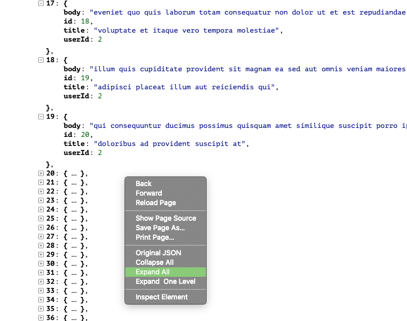

#  PrettyJSON Safari App Extension

With the new Safari old browser plug-ins are no longer supported and only app extension are. So I wrote an app extension to format JSON files in Safari. The JSON formatting is using the [jsonTree](https://github.com/summerstyle/jsonTreeViewer) library with a few modifications.

By default PrettyJSON will only expand the first 20 entries in any JSON array for brevity. You can use the contextual menu to expand all items, collapse all items, or only expand one level into the json. The contextual menu also lets you switch to viewing the original JSON.

To install, run the app once and then goto the preferences in Safari (you can do that by tapping a button in the app) and enable the extension.